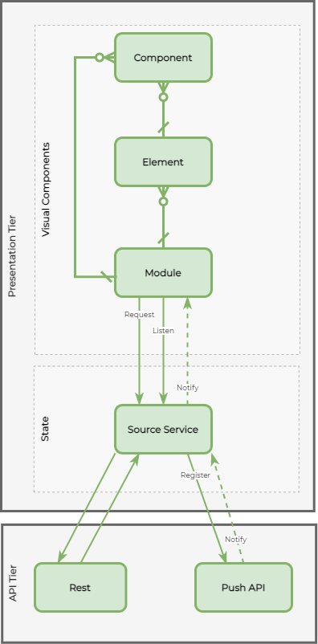
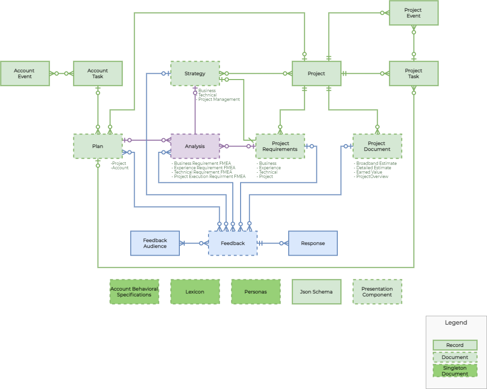

# Documentation

## [ADR (Architectural Decision Records)](./adr/readme.md)

An Architecture Decision Record (ADR) is a document that captures a decision, including the context of how the decision was made and the consequences of adopting the decision.  At Vetrify we use ADRs to document technical decisions.

----

## Font-End Component Architecture

Vetrify is an asynchronous, modular application.

Each page on the site will use web components [stenciljs](https://stenciljs.com/) to compose primary features.  The data structures will be defined in json-schema and compiled to typescript.

The overall application consists of multiple documents.  Each document will have an interactive page on the site, rendered using components.

Each document may have multiple modules to build complete functionality.  Modules will be scoped based on volatility. For example, cross-cutting concerns that appear on every page, like navigation, will be separated from document-specific modules. 

----

### Element

Elements are the core building blocks for assembling the user experience.
* Icons
* Buttons
* Drop-Downs
* etc.

Rules
* elements may not reference other elements, components, or modules 
* elements may not have slots
* elements may not have references to components or mod

----

### Component

Components are higher-order components that use multiple elements to provide, but are not domain-specific 

Rules
* components should not contain other components or modules
* components should compose elements
* components have slots for dynamic elements

----

### Module

Modules are domain-specific building block for user experience.  Modules are composed of multiple components and elements.  Modules should be the primary point of management for all their modules and elements.  They may wire-up state management of their parts through rxjs observables.

Rules
* modules should not reference other modules
* modules should maintain state using a source service

----

### Source Service

Source services are used as singletons to manage state and are the single point of external communication.

Source services may call rest interfaces and register with web socket providers for push notifications.

Rules
* `source` services may only be referenced by hosting pages, templates, and modules.
* components and elements should **not** reference source services. 

----

### Template

Template components are used to demonstrate combining multiple `modules` and the `source` services.

----

### Diagram

----

## Domain Overview

Vetrify is a combination of smaller micro-applications sitting on a underlying foundation.

----

### Foundation

The foundation addresses cross-cutting concerns such as
* Projects
* Users
* Tasks
* Events
* Account behaviors
* Common account definitions/lexicon

----

### Documents

Documents are micro-applications function withing the context of the foundation.  Each document has its data model defined with [json schema](https://json-schema.org/).  Document state is stored in a semi-structured relational store at the document level.

Documents are worked on locally and changes are sent in aggregate through a backing service (rest).

Document changes from other users are pushed through web sockets.

Document Types
* Strategy
  * Business Strategy
  * Technical Strategy
  * Project Management Strategy
  * User Experience Strategy
  * etc.
* Project Requirement
  * Business Process Requirements
  * User Experience Requirements
  * Technical Requirements
  * Project Requirements
  * etc.
* Project Document
  * Broadband Estimates
  * Detailed Estimates
  * Earned Value Tracking
  * Project Overview
  * etc.
* Analysis
  * Business Requirement FMECA (Failure Mode Effects Criticality Analysis)
  * User Experience Requirement FMECA
  * Technical Requirement FMECA
  * Project Execution Requirement FMECA
  * etc.
* Plan
  * Project Plan
  * Business Plan
  * Account Plan
  * etc
* Feedback

----

## Logical Domain Entity Relationship Diagram

