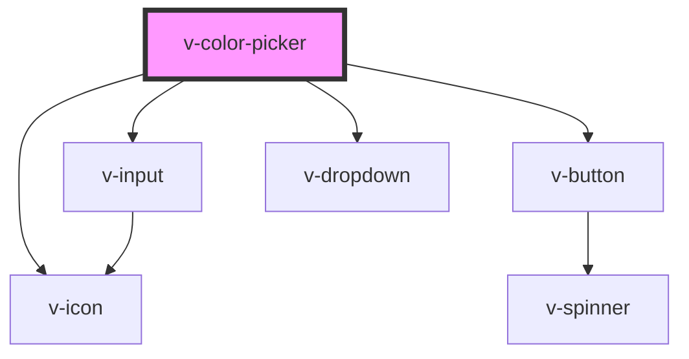

# v-color-picker

<!-- Auto Generated Below -->

## Properties

| Property         | Attribute          | Description                                                                                                                                                                                                                                               | Type                             | Default                                                                                                                                                                                                                                  |
| ---------------- | ------------------ | --------------------------------------------------------------------------------------------------------------------------------------------------------------------------------------------------------------------------------------------------------- | -------------------------------- | ---------------------------------------------------------------------------------------------------------------------------------------------------------------------------------------------------------------------------------------- |
| `disabled`       | `disabled`         | Set to true to disable the color picker.                                                                                                                                                                                                                  | `boolean`                        | `false`                                                                                                                                                                                                                                  |
| `format`         | `format`           | The format to use for the display value. If opacity is enabled, these will translate to HEXA, RGBA, and HSLA respectively. The color picker will always accept user input in any format (including CSS color names) and convert it to the desired format. | `"hex" \| "hsl" \| "rgb"`        | `'hex'`                                                                                                                                                                                                                                  |
| `hoist`          | `hoist`            | Enable this option to prevent the panel from being clipped when the component is placed inside a container with `overflow: auto\|scroll`.                                                                                                                 | `boolean`                        | `false`                                                                                                                                                                                                                                  |
| `inline`         | `inline`           | Set to true to render the color picker inline rather than inside a dropdown.                                                                                                                                                                              | `boolean`                        | `false`                                                                                                                                                                                                                                  |
| `invalid`        | `invalid`          | This will be true when the control is in an invalid state. Validity is determined by the `setCustomValidity()` method using the browser's constraint validation API.                                                                                      | `boolean`                        | `false`                                                                                                                                                                                                                                  |
| `name`           | `name`             | The input's name attribute.                                                                                                                                                                                                                               | `string`                         | `''`                                                                                                                                                                                                                                     |
| `noFormatToggle` | `no-format-toggle` | Removes the format toggle.                                                                                                                                                                                                                                | `boolean`                        | `false`                                                                                                                                                                                                                                  |
| `opacity`        | `opacity`          | Whether to show the opacity slider.                                                                                                                                                                                                                       | `boolean`                        | `false`                                                                                                                                                                                                                                  |
| `size`           | `size`             | Determines the size of the color picker's trigger. This has no effect on inline color pickers.                                                                                                                                                            | `"large" \| "medium" \| "small"` | `'medium'`                                                                                                                                                                                                                               |
| `swatches`       | --                 | An array of predefined color swatches to display. Can include any format the color picker can parse, including HEX(A), RGB(A), HSL(A), and CSS color names.                                                                                               | `string[]`                       | `[     '#d0021b',     '#f5a623',     '#f8e71c',     '#8b572a',     '#7ed321',     '#417505',     '#bd10e0',     '#9013fe',     '#4a90e2',     '#50e3c2',     '#b8e986',     '#000',     '#444',     '#888',     '#ccc',     '#fff',   ]` |
| `uppercase`      | `uppercase`        | By default, the value will be set in lowercase. Set this to true to set it in uppercase instead.                                                                                                                                                          | `boolean`                        | `false`                                                                                                                                                                                                                                  |
| `value`          | `value`            | The current color.                                                                                                                                                                                                                                        | `string`                         | `'#ffffff'`                                                                                                                                                                                                                              |

## Events

| Event          | Description                                                                                               | Type               |
| -------------- | --------------------------------------------------------------------------------------------------------- | ------------------ |
| `v-after-hide` | Emitted after the color picker closes and all transitions are complete.                                   | `CustomEvent<any>` |
| `v-after-show` | Emitted after the color picker opens and all transitions are complete.                                    | `CustomEvent<any>` |
| `v-change`     | Emitted when the color picker's value changes.                                                            | `CustomEvent<any>` |
| `v-hide`       | Emitted when the color picker closes. Calling `event.preventDefault()` will prevent it from being closed. | `CustomEvent<any>` |
| `v-show`       | Emitted when the color picker opens. Calling `event.preventDefault()` will prevent it from being opened.  | `CustomEvent<any>` |

## Methods

### `getFormattedValue(format?: 'hex' | 'hexa' | 'rgb' | 'rgba' | 'hsl' | 'hsla') => Promise<string>`

Returns the current value as a string in the specified format.

#### Returns

Type: `Promise<string>`

### `reportValidity() => Promise<boolean | void>`

Checks for validity and shows the browser's validation message if the control is invalid.

#### Returns

Type: `Promise<boolean | void>`

### `setCustomValidity(message: string) => Promise<void>`

Sets a custom validation message. If `message` is not empty, the field will be considered invalid.

#### Returns

Type: `Promise<void>`

## Shadow Parts

| Part               | Description                          |
| ------------------ | ------------------------------------ |
| `"base"`           | The component's base wrapper.        |
| `"format-button"`  | The toggle format button's base.     |
| `"grid"`           | The color grid.                      |
| `"grid-handle"`    | The color grid's handle.             |
| `"hue-slider"`     | The hue slider.                      |
| `"input"`          | The text input.                      |
| `"opacity-slider"` | The opacity slider.                  |
| `"preview"`        | The preview color.                   |
| `"slider"`         | Hue and opacity sliders.             |
| `"slider-handle"`  | Hue and opacity slider handles.      |
| `"swatch"`         | Each individual swatch.              |
| `"swatches"`       | The container that holds swatches.   |
| `"trigger"`        | The color picker's dropdown trigger. |

## CSS Custom Properties

| Name                   | Description                              |
| ---------------------- | ---------------------------------------- |
| `--grid-handle-size`   | The size of the color grid's handle.     |
| `--grid-height`        | The height of the color grid.            |
| `--grid-width`         | The width of the color grid.             |
| `--slider-handle-size` | The diameter of the slider's handle.     |
| `--slider-height`      | The height of the hue and alpha sliders. |

## Dependencies

### Depends on

- [v-icon](../icon)
- [v-input](../input)
- [v-button](../button)
- [v-dropdown](../dropdown)

### Graph

----------------------------------------------

*Built with [StencilJS](https://stenciljs.com/)*
