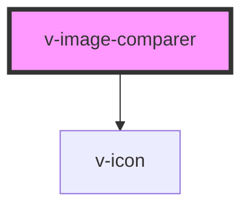

# v-image-comparer

<!-- Auto Generated Below -->

## Properties

| Property   | Attribute  | Description                                  | Type     | Default |
| ---------- | ---------- | -------------------------------------------- | -------- | ------- |
| `position` | `position` | The position of the divider as a percentage. | `number` | `50`    |

## Events

| Event      | Description                               | Type               |
| ---------- | ----------------------------------------- | ------------------ |
| `v-change` | Emitted when the slider position changes. | `CustomEvent<any>` |

## Slots

| Slot            | Description                                      |
| --------------- | ------------------------------------------------ |
| `"after"`       | The after image, an `` or `<svg>` element.  |
| `"before"`      | The before image, an `` or `<svg>` element. |
| `"handle-icon"` | The icon used inside the handle.                 |

## Shadow Parts

| Part        | Description                                               |
| ----------- | --------------------------------------------------------- |
| `"after"`   | The container that holds the "after" image.               |
| `"base"`    | The component's base wrapper.                             |
| `"before"`  | The container that holds the "before" image.              |
| `"divider"` | The divider that separates the images.                    |
| `"handle"`  | The handle that the user drags to expose the after image. |

## CSS Custom Properties

| Name              | Description                     |
| ----------------- | ------------------------------- |
| `--divider-width` | The width of the dividing line. |
| `--handle-size`   | The size of the compare handle. |

## Dependencies

### Depends on

- [v-icon](../icon)

### Graph

----------------------------------------------

*Built with [StencilJS](https://stenciljs.com/)*
