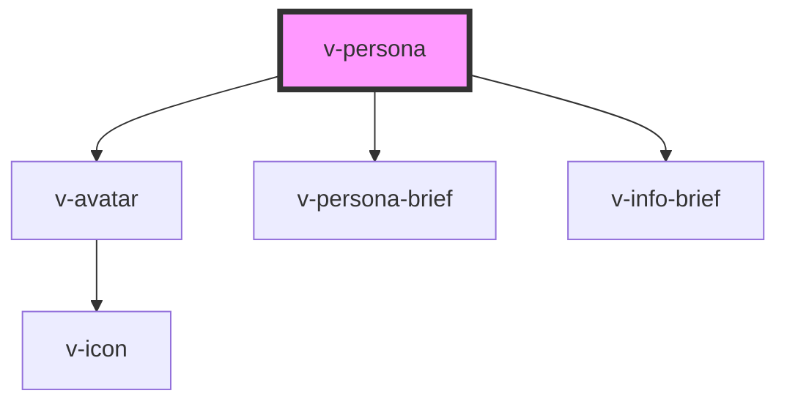

# v-persona

<!-- Auto Generated Below -->

## Properties

| Property         | Attribute        | Description | Type                 | Default     |
| ---------------- | ---------------- | ----------- | -------------------- | ----------- |
| `gender`         | `gender`         |             | `"female" \| "male"` | `undefined` |
| `name`           | `name`           |             | `string`             | `undefined` |
| `title`          | `title`          |             | `string`             | `undefined` |
| `transformation` | `transformation` |             | `string`             | `undefined` |

## Dependencies

### Depends on

- [v-avatar](../avatar)
- [v-persona-brief](../persona-brief)
- [v-info-brief](../info-brief)

### Graph

----------------------------------------------

*Built with [StencilJS](https://stenciljs.com/)*
