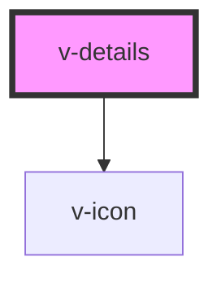

# v-details

<!-- Auto Generated Below -->

## Properties

| Property   | Attribute  | Description                                                                                             | Type      | Default |
| ---------- | ---------- | ------------------------------------------------------------------------------------------------------- | --------- | ------- |
| `disabled` | `disabled` | Set to true to prevent the user from toggling the details.                                              | `boolean` | `false` |
| `open`     | `open`     | Indicates whether or not the details is open. You can use this in lieu of the show/hide methods.        | `boolean` | `false` |
| `summary`  | `summary`  | The summary to show in the details header. If you need to display HTML, use the `summary` slot instead. | `string`  | `''`    |

## Events

| Event          | Description                                                                                          | Type               |
| -------------- | ---------------------------------------------------------------------------------------------------- | ------------------ |
| `v-after-hide` | Emitted after the details closes and all transitions are complete.                                   | `CustomEvent<any>` |
| `v-after-show` | Emitted after the details opens and all transitions are complete.                                    | `CustomEvent<any>` |
| `v-hide`       | Emitted when the details closes. Calling `event.preventDefault()` will prevent it from being closed. | `CustomEvent<any>` |
| `v-show`       | Emitted when the details opens. Calling `event.preventDefault()` will prevent it from being opened.  | `CustomEvent<any>` |

## Methods

### `hide() => Promise<void>`

Hides the alert

#### Returns

Type: `Promise<void>`

### `show() => Promise<void>`

Shows the alert.

#### Returns

Type: `Promise<void>`

## Slots

| Slot        | Description                                                        |
| ----------- | ------------------------------------------------------------------ |
|             | The details' content.                                              |
| `"summary"` | The details' summary. Alternatively, you can use the summary prop. |

## Shadow Parts

| Part             | Description                       |
| ---------------- | --------------------------------- |
| `"base"`         | The component's base wrapper.     |
| `"content"`      | The details content.              |
| `"header"`       | The summary header.               |
| `"summary"`      | The details summary.              |
| `"summary-icon"` | The expand/collapse summary icon. |

## CSS Custom Properties

| Name                     | Description                                                  |
| ------------------------ | ------------------------------------------------------------ |
| `--hide-duration`        | The length of the hide transition.                           |
| `--hide-timing-function` | The timing function (easing) to use for the hide transition. |
| `--show-duration`        | The length of the show transition.                           |
| `--show-timing-function` | The timing function (easing) to use for the show transition. |

## Dependencies

### Depends on

- [v-icon](../icon)

### Graph

----------------------------------------------

*Built with [StencilJS](https://stenciljs.com/)*
