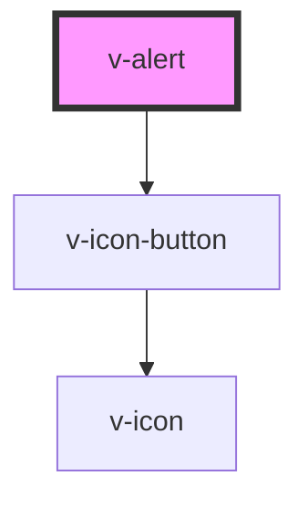

# v-alert

Alert

<!-- Auto Generated Below -->

## Properties

| Property   | Attribute  | Description                                                                                                                                                                                   | Type                                                        | Default     |
| ---------- | ---------- | --------------------------------------------------------------------------------------------------------------------------------------------------------------------------------------------- | ----------------------------------------------------------- | ----------- |
| `closable` | `closable` | Set to true to make the alert closable.                                                                                                                                                       | `boolean`                                                   | `false`     |
| `duration` | `duration` | The length of time, in milliseconds, the alert will show before closing itself. If the user interacts with the alert before it closes (e.g. moves the mouse over it), the timer will restart. | `number`                                                    | `Infinity`  |
| `open`     | `open`     | Indicates whether or not the alert is open. You can use this in lieu of the show/hide methods.                                                                                                | `boolean`                                                   | `false`     |
| `type`     | `type`     | The type of alert.                                                                                                                                                                            | `"danger" \| "info" \| "primary" \| "success" \| "warning"` | `'primary'` |

## Events

| Event          | Description                                                                                        | Type               |
| -------------- | -------------------------------------------------------------------------------------------------- | ------------------ |
| `v-after-hide` | Emitted after the alert closes and all transitions are complete.                                   | `CustomEvent<any>` |
| `v-after-show` | Emitted after the alert opens and all transitions are complete.                                    | `CustomEvent<any>` |
| `v-hide`       | Emitted when the alert closes. Calling `event.preventDefault()` will prevent it from being closed. | `CustomEvent<any>` |
| `v-show`       | Emitted when the alert opens. Calling `event.preventDefault()` will prevent it from being opened.  | `CustomEvent<any>` |

## Methods

### `hide() => Promise<void>`

Hides the alert

#### Returns

Type: `Promise<void>`

### `show() => Promise<void>`

Shows the alert.

#### Returns

Type: `Promise<void>`

### `toast() => Promise<void>`

Displays the alert as a toast notification. This will move the alert out of its position in the DOM and, when
dismissed, it will be removed from the DOM completely. By storing a reference to the alert, you can reuse it by
calling this method again. The returned promise will resolve after the alert is hidden.

#### Returns

Type: `Promise<void>`

## Slots

| Slot     | Description                   |
| -------- | ----------------------------- |
|          | The alert's content.          |
| `"icon"` | An icon to show in the alert. |

## Shadow Parts

| Part             | Description                              |
| ---------------- | ---------------------------------------- |
| `"base"`         | The component's base wrapper.            |
| `"close-button"` | The close button.                        |
| `"icon"`         | The container that wraps the alert icon. |
| `"message"`      | The alert message.                       |

## CSS Custom Properties

| Name           | Description             |
| -------------- | ----------------------- |
| `--box-shadow` | The alert's box shadow. |

## Dependencies

### Depends on

- [v-icon-button](../icon-button)

### Graph

----------------------------------------------

*Built with [StencilJS](https://stenciljs.com/)*
