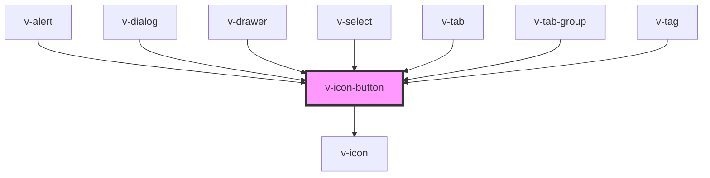

# v-icon-button

<!-- Auto Generated Below -->

## Properties

| Property   | Attribute  | Description                                                                                                                                                                        | Type      | Default     |
| ---------- | ---------- | ---------------------------------------------------------------------------------------------------------------------------------------------------------------------------------- | --------- | ----------- |
| `disabled` | `disabled` | Set to true to disable the button.                                                                                                                                                 | `boolean` | `false`     |
| `label`    | `label`    | A description that gets read by screen readers and other assistive devices. For optimal accessibility, you should always include a label that describes what the icon button does. | `string`  | `undefined` |
| `library`  | `library`  | The name of a registered custom icon library.                                                                                                                                      | `string`  | `undefined` |
| `name`     | `name`     | The name of the icon to draw.                                                                                                                                                      | `string`  | `undefined` |
| `src`      | `src`      | An external URL of an SVG file.                                                                                                                                                    | `string`  | `undefined` |

## Shadow Parts

| Part     | Description                   |
| -------- | ----------------------------- |
| `"base"` | The component's base wrapper. |

## Dependencies

### Used by

 - [v-alert](../alert)
 - [v-dialog](../dialog)
 - [v-drawer](../drawer)
 - [v-select](../select)
 - [v-tab](../tab)
 - [v-tab-group](../tab-group)
 - [v-tag](../tag)

### Depends on

- [v-icon](../icon)

### Graph

----------------------------------------------

*Built with [StencilJS](https://stenciljs.com/)*
