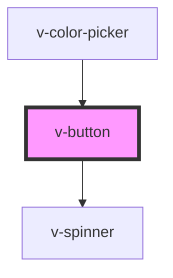

# v-button

<!-- Auto Generated Below -->

## Properties

| Property   | Attribute  | Description                                                                                            | Type                                                                               | Default     |
| ---------- | ---------- | ------------------------------------------------------------------------------------------------------ | ---------------------------------------------------------------------------------- | ----------- |
| `caret`    | `caret`    | Set to true to draw the button with a caret for use with dropdowns, popovers, etc.                     | `boolean`                                                                          | `false`     |
| `circle`   | `circle`   | Set to true to draw a circle button.                                                                   | `boolean`                                                                          | `false`     |
| `disabled` | `disabled` | Set to true to disable the button.                                                                     | `boolean`                                                                          | `false`     |
| `download` | `download` | Tells the browser to download the linked file as this filename. Only used when `href` is set.          | `string`                                                                           | `undefined` |
| `href`     | `href`     | When set, the underlying button will be rendered as an `<a>` with this `href` instead of a `<button>`. | `string`                                                                           | `undefined` |
| `loading`  | `loading`  | Set to true to draw the button in a loading state.                                                     | `boolean`                                                                          | `false`     |
| `name`     | `name`     | An optional name for the button. Ignored when `href` is set.                                           | `string`                                                                           | `undefined` |
| `pill`     | `pill`     | Set to true to draw a pill-style button with rounded edges.                                            | `boolean`                                                                          | `false`     |
| `size`     | `size`     | The button's size.                                                                                     | `"large" \| "medium" \| "small"`                                                   | `'medium'`  |
| `submit`   | `submit`   | Indicates if activating the button should submit the form. Ignored when `href` is set.                 | `boolean`                                                                          | `false`     |
| `target`   | `target`   | Tells the browser where to open the link. Only used when `href` is set.                                | `"_blank" \| "_parent" \| "_self" \| "_top"`                                       | `undefined` |
| `type`     | `type`     | The button's type.                                                                                     | `"danger" \| "default" \| "info" \| "primary" \| "success" \| "text" \| "warning"` | `'default'` |
| `value`    | `value`    | An optional value for the button. Ignored when `href` is set.                                          | `string`                                                                           | `undefined` |

## Events

| Event     | Description                          | Type               |
| --------- | ------------------------------------ | ------------------ |
| `v-blur`  | Emitted when the button loses focus. | `CustomEvent<any>` |
| `v-focus` | Emitted when the button gains focus. | `CustomEvent<any>` |

## Methods

### `removeFocus() => Promise<void>`

Removes focus from the button.

#### Returns

Type: `Promise<void>`

### `setFocus(options?: FocusOptions) => Promise<void>`

Sets focus on the button.

#### Returns

Type: `Promise<void>`

## Slots

| Slot       | Description                                               |
| ---------- | --------------------------------------------------------- |
|            | The button's label.                                       |
| `"prefix"` | Used to prepend an icon or similar element to the button. |
| `"suffix"` | Used to append an icon or similar element to the button.  |

## Shadow Parts

| Part       | Description                   |
| ---------- | ----------------------------- |
| `"base"`   | The component's base wrapper. |
| `"caret"`  | The button's caret.           |
| `"label"`  | The button's label.           |
| `"prefix"` | The prefix container.         |
| `"suffix"` | The suffix container.         |

## Dependencies

### Used by

 - [v-color-picker](../color-picker)

### Depends on

- [v-spinner](../spinner)

### Graph

----------------------------------------------

*Built with [StencilJS](https://stenciljs.com/)*
