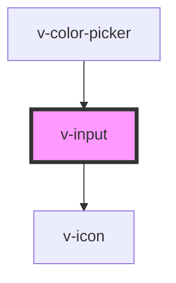

# v-input

<!-- Auto Generated Below -->

## Properties

| Property         | Attribute         | Description                                                                                                                                                                                                   | Type                                                                                  | Default     |
| ---------------- | ----------------- | ------------------------------------------------------------------------------------------------------------------------------------------------------------------------------------------------------------- | ------------------------------------------------------------------------------------- | ----------- |
| `autocapitalize` | `autocapitalize`  | The input's autocaptialize attribute.                                                                                                                                                                         | `string`                                                                              | `undefined` |
| `autocomplete`   | `autocomplete`    | The input's autocomplete attribute.                                                                                                                                                                           | `string`                                                                              | `undefined` |
| `autocorrect`    | `autocorrect`     | The input's autocorrect attribute.                                                                                                                                                                            | `string`                                                                              | `undefined` |
| `autofocus`      | `autofocus`       | The input's autofocus attribute.                                                                                                                                                                              | `boolean`                                                                             | `undefined` |
| `clearable`      | `clearable`       | Set to true to add a clear button when the input is populated.                                                                                                                                                | `boolean`                                                                             | `false`     |
| `disabled`       | `disabled`        | Set to true to disable the input.                                                                                                                                                                             | `boolean`                                                                             | `false`     |
| `helpText`       | `help-text`       | The input's help text. Alternatively, you can use the help-text slot.                                                                                                                                         | `string`                                                                              | `''`        |
| `inputmode`      | `inputmode`       | The input's inputmode attribute.                                                                                                                                                                              | `"decimal" \| "email" \| "none" \| "numeric" \| "search" \| "tel" \| "text" \| "url"` | `undefined` |
| `invalid`        | `invalid`         | This will be true when the control is in an invalid state. Validity is determined by props such as `type`, `required`, `minlength`, `maxlength`, and `pattern` using the browser's constraint validation API. | `boolean`                                                                             | `false`     |
| `label`          | `label`           | The input's label. Alternatively, you can use the label slot.                                                                                                                                                 | `string`                                                                              | `''`        |
| `max`            | `max`             | The input's maximum value.                                                                                                                                                                                    | `number`                                                                              | `undefined` |
| `maxlength`      | `maxlength`       | The maximum length of input that will be considered valid.                                                                                                                                                    | `number`                                                                              | `undefined` |
| `min`            | `min`             | The input's minimum value.                                                                                                                                                                                    | `number`                                                                              | `undefined` |
| `minlength`      | `minlength`       | The minimum length of input that will be considered valid.                                                                                                                                                    | `number`                                                                              | `undefined` |
| `name`           | `name`            | The input's name attribute.                                                                                                                                                                                   | `string`                                                                              | `''`        |
| `pattern`        | `pattern`         | A pattern to validate input against.                                                                                                                                                                          | `string`                                                                              | `undefined` |
| `pill`           | `pill`            | Set to true to draw a pill-style input with rounded edges.                                                                                                                                                    | `boolean`                                                                             | `false`     |
| `placeholder`    | `placeholder`     | The input's placeholder text.                                                                                                                                                                                 | `string`                                                                              | `undefined` |
| `readonly`       | `readonly`        | Set to true to make the input readonly.                                                                                                                                                                       | `boolean`                                                                             | `false`     |
| `required`       | `required`        | Set to true to make the input a required field.                                                                                                                                                               | `boolean`                                                                             | `undefined` |
| `size`           | `size`            | The input's size.                                                                                                                                                                                             | `"large" \| "medium" \| "small"`                                                      | `'medium'`  |
| `spellcheck`     | `spellcheck`      | Enables spell checking on the input.                                                                                                                                                                          | `boolean`                                                                             | `undefined` |
| `step`           | `step`            | The input's step attribute.                                                                                                                                                                                   | `number`                                                                              | `undefined` |
| `togglePassword` | `toggle-password` | Set to true to add a password toggle button for password inputs.                                                                                                                                              | `boolean`                                                                             | `false`     |
| `type`           | `type`            | The input's type.                                                                                                                                                                                             | `"email" \| "number" \| "password" \| "search" \| "tel" \| "text" \| "url"`           | `'text'`    |
| `value`          | `value`           | The input's value attribute.                                                                                                                                                                                  | `string`                                                                              | `''`        |

## Events

| Event      | Description                                 | Type               |
| ---------- | ------------------------------------------- | ------------------ |
| `v-blur`   | Emitted when the control loses focus.       | `CustomEvent<any>` |
| `v-change` | Emitted when the control's value changes.   | `CustomEvent<any>` |
| `v-clear`  | Emitted when the clear button is activated. | `CustomEvent<any>` |
| `v-focus`  | Emitted when the control gains focus.       | `CustomEvent<any>` |
| `v-input`  | Emitted when the control receives input.    | `CustomEvent<any>` |

## Methods

### `removeFocus() => Promise<void>`

Removes focus from the input.

#### Returns

Type: `Promise<void>`

### `reportValidity() => Promise<boolean>`

Checks for validity and shows the browser's validation message if the control is invalid.

#### Returns

Type: `Promise<boolean>`

### `select() => Promise<void>`

Selects all the text in the input.

#### Returns

Type: `Promise<void>`

### `setCustomValidity(message: string) => Promise<void>`

Sets a custom validation message. If `message` is not empty, the field will be considered invalid.

#### Returns

Type: `Promise<void>`

### `setFocus(options?: FocusOptions) => Promise<void>`

Sets focus on the input.

#### Returns

Type: `Promise<void>`

### `setRangeText(replacement: string, start: number, end: number, selectMode?: 'select' | 'start' | 'end' | 'preserve') => Promise<void>`

Replaces a range of text with a new string.

#### Returns

Type: `Promise<void>`

### `setSelectionRange(selectionStart: number, selectionEnd: number, selectionDirection?: 'forward' | 'backward' | 'none') => Promise<void>`

Sets the start and end positions of the text selection (0-based).

#### Returns

Type: `Promise<void>`

## Slots

| Slot                   | Description                                                                                   |
| ---------------------- | --------------------------------------------------------------------------------------------- |
| `"clear-icon"`         | An icon to use in lieu of the default clear icon.                                             |
| `"help-text"`          | Help text that describes how to use the input. Alternatively, you can use the help-text prop. |
| `"hide-password-icon"` | An icon to use in lieu of the default hide password icon.                                     |
| `"label"`              | The input's label. Alternatively, you can use the label prop.                                 |
| `"prefix"`             | Used to prepend an icon or similar element to the input.                                      |
| `"show-password-icon"` | An icon to use in lieu of the default show password icon.                                     |
| `"suffix"`             | Used to append an icon or similar element to the input.                                       |

## Shadow Parts

| Part                       | Description                                                  |
| -------------------------- | ------------------------------------------------------------ |
| `"base"`                   | The component's base wrapper.                                |
| `"clear-button"`           | The clear button.                                            |
| `"form-control"`           | The form control that wraps the label, input, and help-text. |
| `"help-text"`              | The input help text.                                         |
| `"input"`                  | The input control.                                           |
| `"label"`                  | The input label.                                             |
| `"password-toggle-button"` | The password toggle button.                                  |
| `"prefix"`                 | The input prefix container.                                  |
| `"suffix"`                 | The input suffix container.                                  |

## CSS Custom Properties

| Name           | Description                                                                           |
| -------------- | ------------------------------------------------------------------------------------- |
| `--focus-ring` | The focus ring style to use when the control receives focus, a `box-shadow` property. |

## Dependencies

### Used by

 - [v-color-picker](../color-picker)

### Depends on

- [v-icon](../icon)

### Graph

----------------------------------------------

*Built with [StencilJS](https://stenciljs.com/)*
