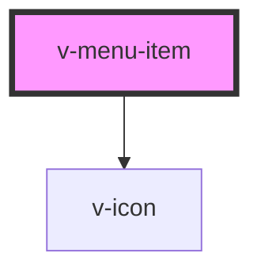

# v-menu-item

<!-- Auto Generated Below -->

## Properties

| Property   | Attribute  | Description                                                                                               | Type      | Default |
| ---------- | ---------- | --------------------------------------------------------------------------------------------------------- | --------- | ------- |
| `checked`  | `checked`  | Set to true to draw the item in a checked state.                                                          | `boolean` | `false` |
| `disabled` | `disabled` | Set to true to draw the menu item in a disabled state.                                                    | `boolean` | `false` |
| `value`    | `value`    | A unique value to store in the menu item. This can be used as a way to identify menu items when selected. | `string`  | `''`    |

## Methods

### `removeFocus() => Promise<void>`

Removes focus from the button.

#### Returns

Type: `Promise<void>`

### `setFocus(options?: FocusOptions) => Promise<void>`

Sets focus on the button.

#### Returns

Type: `Promise<void>`

## Slots

| Slot       | Description                                                  |
| ---------- | ------------------------------------------------------------ |
|            | The menu item's label.                                       |
| `"prefix"` | Used to prepend an icon or similar element to the menu item. |
| `"suffix"` | Used to append an icon or similar element to the menu item.  |

## Shadow Parts

| Part             | Description                                |
| ---------------- | ------------------------------------------ |
| `"base"`         | The component's base wrapper.              |
| `"checked-icon"` | The container that wraps the checked icon. |
| `"label"`        | The menu item label.                       |
| `"prefix"`       | The prefix container.                      |
| `"suffix"`       | The suffix container.                      |

## Dependencies

### Depends on

- [v-icon](../icon)

### Graph

----------------------------------------------

*Built with [StencilJS](https://stenciljs.com/)*
