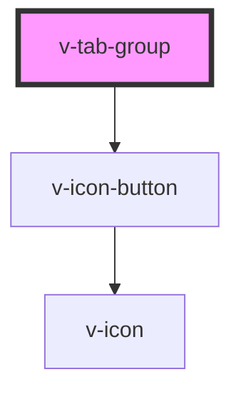

# v-tab-group

<!-- Auto Generated Below -->

## Properties

| Property           | Attribute            | Description                                                | Type                                     | Default |
| ------------------ | -------------------- | ---------------------------------------------------------- | ---------------------------------------- | ------- |
| `noScrollControls` | `no-scroll-controls` | Disables the scroll arrows that appear when tabs overflow. | `boolean`                                | `false` |
| `placement`        | `placement`          | The placement of the tabs.                                 | `"bottom" \| "left" \| "right" \| "top"` | `'top'` |

## Events

| Event        | Description                   | Type                             |
| ------------ | ----------------------------- | -------------------------------- |
| `v-tab-hide` | Emitted when a tab is hidden. | `CustomEvent<{ name: string; }>` |
| `v-tab-show` | Emitted when a tab is shown.  | `CustomEvent<{ name: string; }>` |

## Methods

### `show(panel: string) => Promise<void>`

Shows the specified tab panel.

#### Returns

Type: `Promise<void>`

## Slots

| Slot    | Description                                    |
| ------- | ---------------------------------------------- |
|         | Used for grouping tab panels in the tab group. |
| `"nav"` | Used for grouping tabs in the tab group.       |

## Shadow Parts

| Part                     | Description                                                                                 |
| ------------------------ | ------------------------------------------------------------------------------------------- |
| `"active-tab-indicator"` | An element that displays the currently selected tab. This is a child of the tabs container. |
| `"base"`                 | The component's base wrapper.                                                               |
| `"body"`                 | The tab group body where tab panels are slotted in.                                         |
| `"nav"`                  | The tab group navigation container.                                                         |
| `"scroll-button"`        | The previous and next scroll buttons that appear when tabs are scrollable.                  |
| `"tabs"`                 | The container that wraps the slotted tabs.                                                  |

## CSS Custom Properties

| Name                  | Description                                  |
| --------------------- | -------------------------------------------- |
| `--tabs-border-color` | The color of the border that separates tabs. |

## Dependencies

### Depends on

- [v-icon-button](../icon-button)

### Graph

----------------------------------------------

*Built with [StencilJS](https://stenciljs.com/)*
