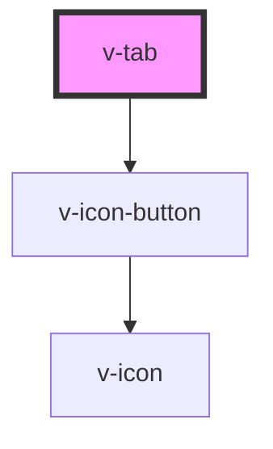

# v-tab

<!-- Auto Generated Below -->

## Properties

| Property   | Attribute  | Description                                                                                      | Type      | Default |
| ---------- | ---------- | ------------------------------------------------------------------------------------------------ | --------- | ------- |
| `active`   | `active`   | Set to true to draw the tab in an active state.                                                  | `boolean` | `false` |
| `closable` | `closable` | When true, the tab will be rendered with a close icon.                                           | `boolean` | `false` |
| `disabled` | `disabled` | Set to true to draw the tab in a disabled state.                                                 | `boolean` | `false` |
| `panel`    | `panel`    | The name of the tab panel the tab will control. The panel must be located in the same tab group. | `string`  | `''`    |

## Events

| Event     | Description                                                         | Type               |
| --------- | ------------------------------------------------------------------- | ------------------ |
| `v-close` | Emitted when the tab is closable and the close button is activated. | `CustomEvent<any>` |

## Methods

### `removeFocus() => Promise<void>`

Removes focus from the tab.

#### Returns

Type: `Promise<void>`

### `setFocus(options?: FocusOptions) => Promise<void>`

Sets focus to the tab.

#### Returns

Type: `Promise<void>`

## Slots

| Slot | Description      |
| ---- | ---------------- |
|      | The tab's label. |

## Shadow Parts

| Part             | Description                                                |
| ---------------- | ---------------------------------------------------------- |
| `"base"`         | The component's base wrapper.                              |
| `"close-button"` | The close button, which is the icon button's base wrapper. |

## CSS Custom Properties

| Name           | Description                  |
| -------------- | ---------------------------- |
| `--focus-ring` | The focus ring's box shadow. |

## Dependencies

### Depends on

- [v-icon-button](../icon-button)

### Graph

----------------------------------------------

*Built with [StencilJS](https://stenciljs.com/)*
