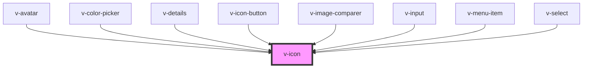

# v-icon

<!-- Auto Generated Below -->

## Properties

| Property  | Attribute | Description                                                                                                   | Type     | Default     |
| --------- | --------- | ------------------------------------------------------------------------------------------------------------- | -------- | ----------- |
| `label`   | `label`   | An alternative description to use for accessibility. If omitted, the name or src will be used to generate it. | `string` | `undefined` |
| `library` | `library` | The name of a registered custom icon library.                                                                 | `string` | `'default'` |
| `name`    | `name`    | The name of the icon to draw.                                                                                 | `string` | `undefined` |
| `src`     | `src`     | An external URL of an SVG file.                                                                               | `string` | `undefined` |

## Events

| Event     | Description                           | Type                                |
| --------- | ------------------------------------- | ----------------------------------- |
| `v-error` | Emitted when the icon failed to load. | `CustomEvent<{ status?: number; }>` |
| `v-load`  | Emitted when the icon has loaded.     | `CustomEvent<any>`                  |

## Shadow Parts

| Part     | Description                   |
| -------- | ----------------------------- |
| `"base"` | The component's base wrapper. |

## Dependencies

### Used by

 - [v-avatar](../avatar)
 - [v-color-picker](../color-picker)
 - [v-details](../details)
 - [v-icon-button](../icon-button)
 - [v-image-comparer](../image-comparer)
 - [v-input](../input)
 - [v-menu-item](../menu-item)
 - [v-select](../select)

### Graph

----------------------------------------------

*Built with [StencilJS](https://stenciljs.com/)*
