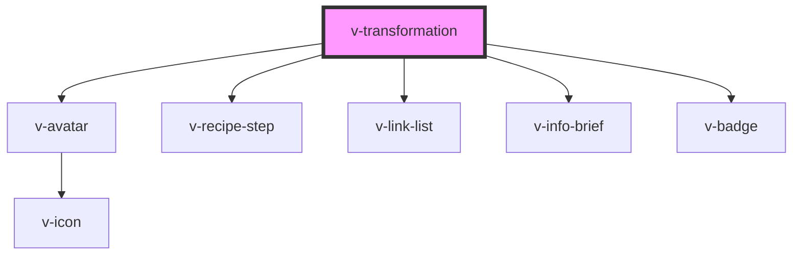

# v-foundation

<!-- Auto Generated Below -->

## Properties

| Property   | Attribute  | Description | Type                                                      | Default     |
| ---------- | ---------- | ----------- | --------------------------------------------------------- | ----------- |
| `checked`  | `checked`  |             | `boolean`                                                 | `undefined` |
| `status`   | `status`   |             | `"Approved" \| "In Progress" \| "Rejected" \| "Verified"` | `undefined` |
| `subject`  | `subject`  |             | `string`                                                  | `undefined` |
| `subtitle` | `subtitle` |             | `string`                                                  | `undefined` |
| `title`    | `title`    |             | `string`                                                  | `undefined` |
| `verb`     | `verb`     |             | `string`                                                  | `undefined` |

## Slots

| Slot     | Description                                                    |
| -------- | -------------------------------------------------------------- |
| `"icon"` | The default icon to use when no image or initials are present. |

## Shadow Parts

| Part         | Description                                   |
| ------------ | --------------------------------------------- |
| `"base"`     | The component's base wrapper.                 |
| `"icon"`     | The container that wraps the avatar icon.     |
| `"image"`    | The avatar image.                             |
| `"initials"` | The container that wraps the avatar initials. |

## Dependencies

### Depends on

- [v-avatar](../avatar)
- [v-recipe-step](../recipe-step)
- [v-link-list](../link-list)
- [v-info-brief](../info-brief)
- [v-badge](../badge)

### Graph

----------------------------------------------

*Built with [StencilJS](https://stenciljs.com/)*
