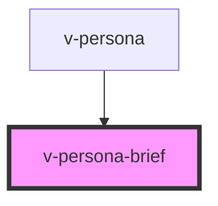

# v-persona-brief

<!-- Auto Generated Below -->

## Properties

| Property | Attribute | Description | Type     | Default     |
| -------- | --------- | ----------- | -------- | ----------- |
| `name`   | `name`    |             | `string` | `undefined` |
| `title`  | `title`   |             | `string` | `undefined` |

## Slots

| Slot     | Description                                                    |
| -------- | -------------------------------------------------------------- |
| `"icon"` | The default icon to use when no image or initials are present. |

## Shadow Parts

| Part         | Description                                   |
| ------------ | --------------------------------------------- |
| `"base"`     | The component's base wrapper.                 |
| `"icon"`     | The container that wraps the avatar icon.     |
| `"image"`    | The avatar image.                             |
| `"initials"` | The container that wraps the avatar initials. |

## Dependencies

### Used by

 - [v-persona](../persona)

### Graph

----------------------------------------------

*Built with [StencilJS](https://stenciljs.com/)*
